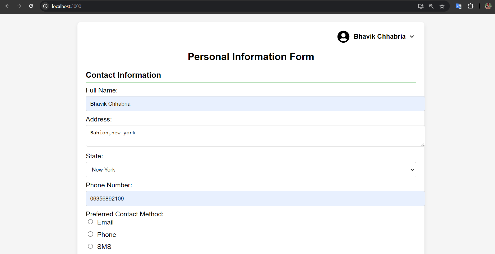
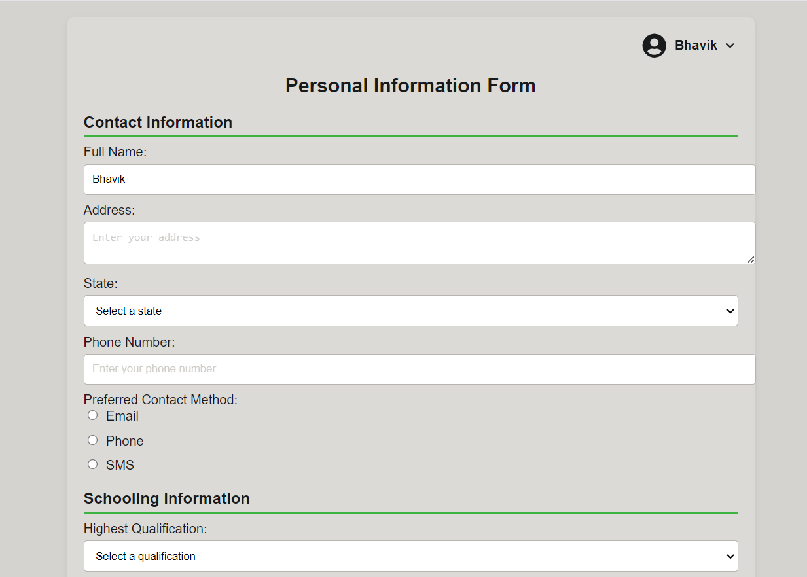
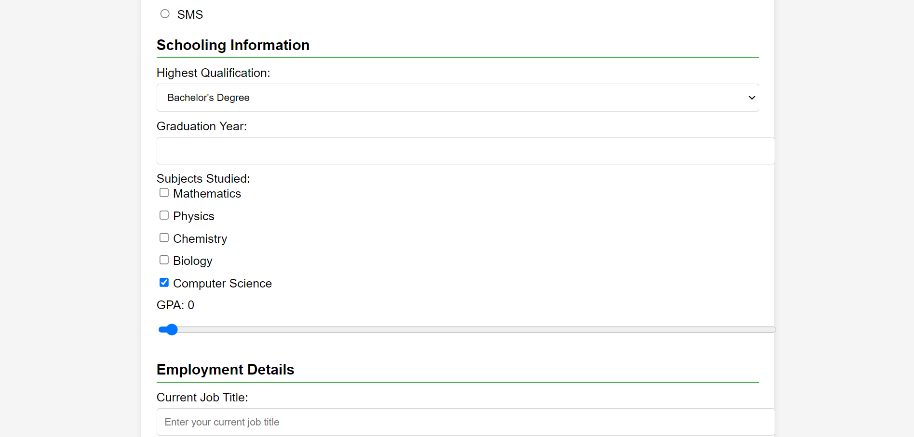
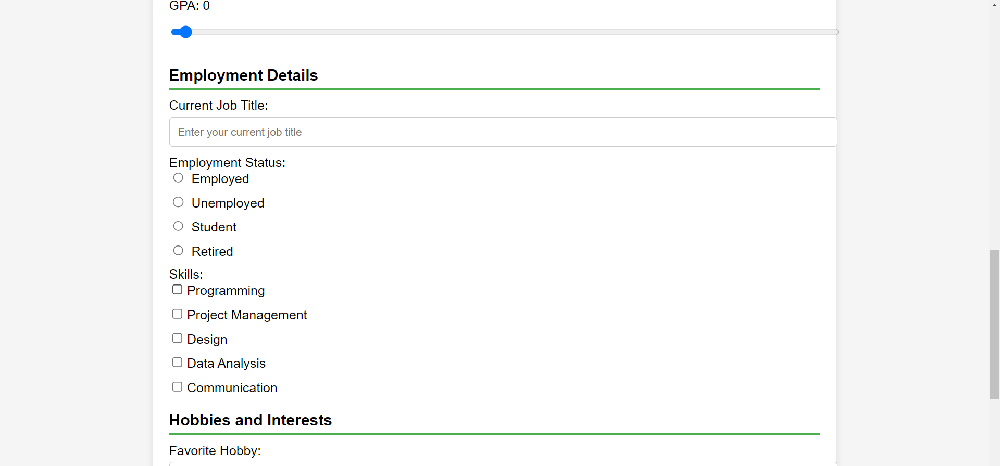
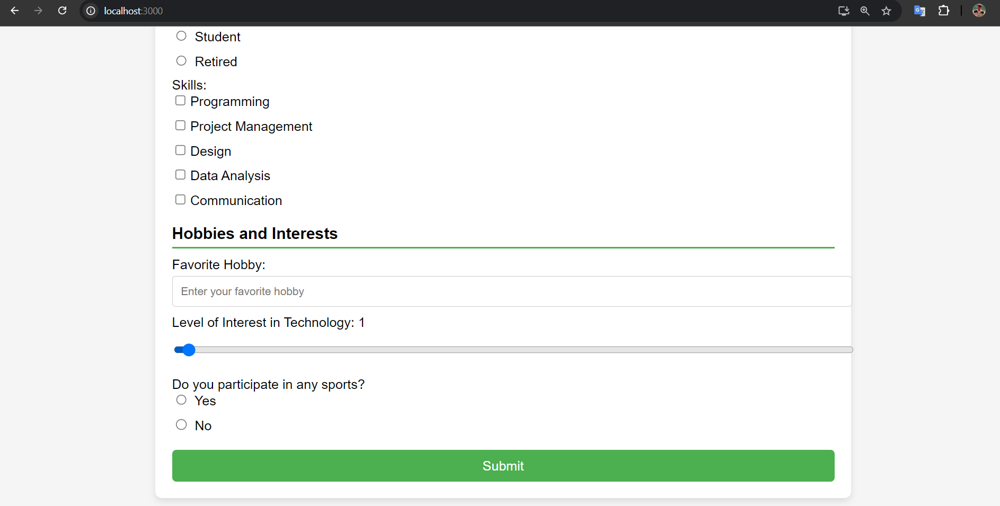
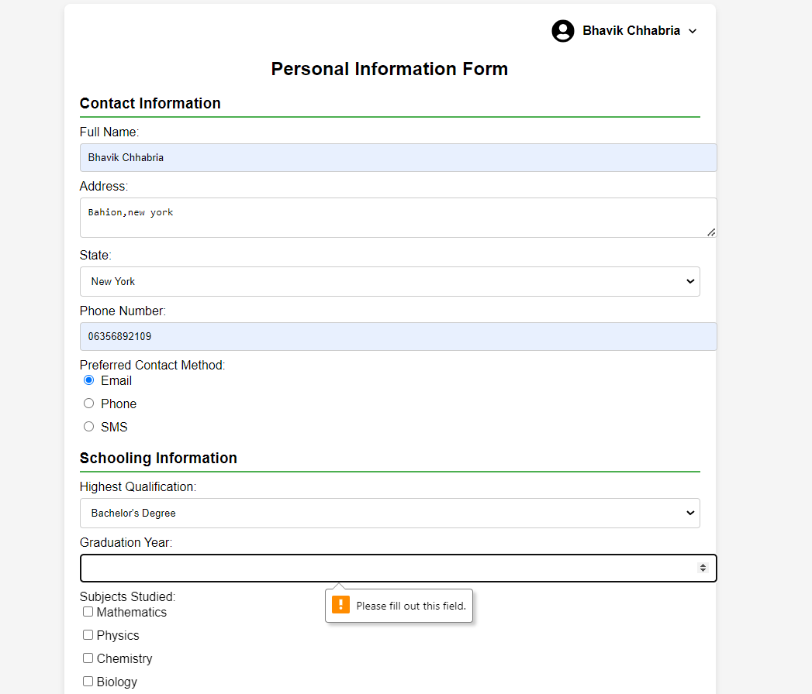
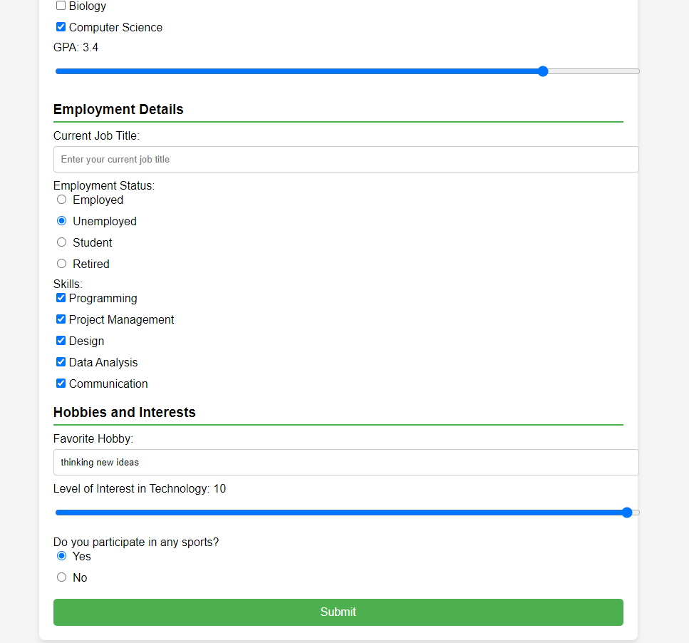

# Getting Started with Create React App

## Available Scripts

In the project directory, you can run:

### `npm start`

Runs the app in the development mode.\
Open [http://localhost:3000](http://localhost:3000) to view it in your browser.

The page will reload when you make changes.\
You may also see any lint errors in the console.

### `steps by step tutorial for dynamic form creation`

#### `1) create one folder and open in it with vscode `

### Navigate to the Directory:

`Change to the directory where you want to create the project folder. For example:`

`cd path/to/your/directory`

#### Create a New Folder:

`Use the following command to create a new folder named personal-information-form (you can name it anything you prefer):`

mkdir personal-information-form
Navigate into the New Folder:

Change into the newly created folder:

cd personal-information-form

### 2) Open the Folder in Visual Studio Code

Open Visual Studio Code:
Launch VSCode from your applications menu or by using the

code .

If code command doesn't work, you may need to install the VSCode command-line interface (CLI). Follow the instructions here for your operating system.

### 3) Initialize a New React Project

Set Up Your React Application:

Ensure you have Node.js and npm installed. If you haven’t installed them yet, download and install from Node.js.
Create a New React App:

Use the following command to create a new React application inside the folder:

`npx create-react-app .`

The . at the end indicates that you want to create the React app in the current directory.
Wait for Installation:

4. Start the Development Server
   Run the Application:

`Start the React development server with:`

`npm start`

### Open Your Browser:

`After the server starts, it will automatically open your default browser. If not, navigate to http://localhost:3000 to see your application.`

5. Modify Your Project

You can now begin modifying the code for your Personal Information Form. Open src/App.js and other relevant files in the src folder to implement the form.
Save Changes:

Remember to save your changes in VSCode. The application will automatically reload in the browser to reflect the updates.

### This is Dynamically changing the name in real time State and this is also helps in providing feedback to users for input changes.

#### 6) Commit Your Changes

#### If you want to track your changes, initialize a git repository:

`git init`

### Add Files and Commit:

#### `Add your files to the repository and make an initial commit:`

`git add ..`

`git commit -m "Initial commit"`

`git push -u origin master`

### Screenshots:-

